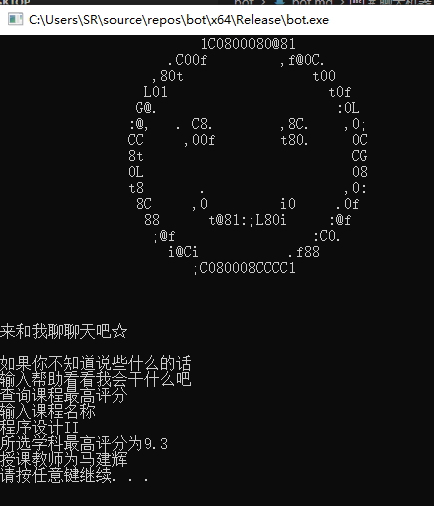

# 聊天机器人
任呈祥 PB20020574：主要负责C部分的编写，占总工作量的50%

陈建宇 PB20030767：主要负责python部分的编写，占总工作量的50%
## 功能预览
### 1. 总体预览

首次使用时，需要输入姓名，生日等信息，这些会以文件形式储存。

输入信息后或者打开时，bot会进行打招呼，并根据时间显示相应图形。


之后进入聊天主页面


输入帮助后进入功能菜单
### 2. 查询时间功能

效果预览：


### 3. 查询邮箱功能

输入老师的邮箱进行查询


### 4. 讲笑话功能

效果预览：


### 5. 求签功能

效果预览：


### 6. 查询老师信息

效果预览：


### 7. 查询课程最高评分

该功能会访问评课社区网站并查询相应课程的最高评分，效果预览：


### 8. 查询课程评分

该功能会访问评课社区网站并查询相应课程相应老师的评分，并根据评分给出相应建议

效果预览：


### 9. 聊天功能

输入聊天内容后，机器人根据当地词库查找关键字，在输出相应回答


如果词库没有，则会利用必应进行搜索，输入对应序号即可跳转


## C++代码部分
由于篇幅问题，基础代码暂不写出
### 1. UTF8和GBK的转换
由于汉字编码问题，读取文件时可能需要进行编码的转换
UTF8转GBK：
```cpp
string UTF8ToGB(const char* str)
{
	string result;
	WCHAR *strSrc;
	LPSTR szRes;

	//获得临时变量的大小
	int i = MultiByteToWideChar(CP_UTF8, 0, str, -1, NULL, 0);
	strSrc = new WCHAR[i + 1];
	MultiByteToWideChar(CP_UTF8, 0, str, -1, strSrc, i);

	//获得临时变量的大小
	i = WideCharToMultiByte(CP_ACP, 0, strSrc, -1, NULL, 0, NULL, NULL);
	szRes = new CHAR[i + 1];
	WideCharToMultiByte(CP_ACP, 0, strSrc, -1, szRes, i, NULL, NULL);

	result = szRes;
	delete[]strSrc;
	delete[]szRes;

	return result;
}
```
GBK转UTF8
```cpp
string GBKToUTF8(const std::string& strGBK)
{
	string strOutUTF8 = "";
	WCHAR * str1;
	int n = MultiByteToWideChar(CP_ACP, 0, strGBK.c_str(), -1, NULL, 0);
	str1 = new WCHAR[n];
	MultiByteToWideChar(CP_ACP, 0, strGBK.c_str(), -1, str1, n); 
	n = WideCharToMultiByte(CP_UTF8, 0, str1, -1, NULL, 0, NULL, NULL);
	char * str2 = new char[n];
	WideCharToMultiByte(CP_UTF8, 0, str1, -1, str2, n, NULL, NULL);
	strOutUTF8 = str2;
	delete[]str1;
	str1 = NULL;
	delete[]str2;
	str2 = NULL;
	return strOutUTF8;
}
```
### 2. 文件读写操作
主要利用C++的fstream库进行文件操作

写文件
```cpp
void init()
{
	my_clear();
	printf("欢迎初次使用bot，下边进行初始设置\n");
	system("pause");
	ofstream data("data.txt");
	string buffer;
	cout << "请输入对您的称呼:" << endl;
	cin >> buffer;
	data << buffer << endl;
	cout << "请输入您的性别:" << endl;
	cin >> buffer;
	data << buffer << endl;
	cout << "请输入您的出生年月日:" << endl;
	int a, b, c;
	char d;
	cin >> a;
	d = getchar();
	cin >> b;
	d = getchar();
	cin >> c;
	data << a << endl;
	data << b << endl;
	data << c << endl;
	getID();
}
```
读文件
```cpp
void getstate(ifstream &data, string &name, string &sex, int &year, int &month, int &day)
{
    data.open("data.txt");
	getline(data, name);
	getline(data, sex);
	string buffer;
	getline(data, buffer);
	year = atoi(buffer.c_str());
	getline(data, buffer);
	month = atoi(buffer.c_str());
	getline(data, buffer);
	day = atoi(buffer.c_str());
}
```
判断文件是否为空
```cpp
int judge_null(ifstream &fin)
{
	fin.seekg(0, ios::end); //将文件指针指向文件末端
	streampos fp = fin.tellg(); //fp为文件指针的偏移量
	if (int(fp) == 0) // 偏移量为0，证明文件为空，为首次进入系统
		return 1;
	else return 0;
}
```
### 3. ASCII图片输出
ASCII图片文件储存在当地的txt文档里，在输出ASCII图片时只需对应的文档，全部输出即可

如笑脸在txt中储存如下
```dotnetcli
                         1C0800080@81                         
                     .C00f         ,f@0C.                     
                   ,80t                t00                    
                  L01                    t0f                  
                 G@.                      :0L                 
                :@,   . C8.        ,8C.    ,0;                
                CC     ,00f        t80.     0C                
                8t                          CG                
                0L                          08                
                t8       .                 ,0:                
                 8C     ,0         i0     .0f                 
                  88      t@81:;L80i     :@f                  
                   ;@f                 :C0.                   
                     i@Ci           .f88                      
                        ;C080008CCCC1                         
```
调用该函数即可输出
```cpp
void outima(string s)
{
	ifstream ima(s);
	string buffer;
	while (getline(ima, buffer))
	{
		cout << buffer << endl;
	}
	ima.close();
}
```
在把图片转换为ASCII图片时，利用了转换网站：https://www.qtool.net/imgascii
### 4. 利用C调用python
参考网站：

https://blog.csdn.net/weixin_44220689/article/details/123470930
https://blog.csdn.net/yangtuanzi1118/article/details/122134428
https://blog.csdn.net/qq_30460949/article/details/103087392
https://blog.csdn.net/weixin_42406911/article/details/118968738

使用的编译器是vs2017，首先需要配置环境，如第一个网址文章中所说

需要加上头文件#include"Python.h"

调用示例
```cpp
void getinfo()
{
	Py_Initialize(); /*初始化python解释器,告诉编译器要用的python编译器*/
	PyRun_SimpleString("import sys");
	PyRun_SimpleString("sys.path.append('./')");
	PyRun_SimpleString("import getinfo"); /*调用python文件,文件名为getinfo.py*/
	Py_Finalize(); /*结束python解释器，释放资源*/
	system("pause");
}
```
传参调用示例
```cpp
void notunder(string sin)
{
	my_clear("ku.txt");
	cout << "虽然我听不懂，但你可能想找这些：" << endl;
	Py_Initialize(); /*初始化python解释器,告诉编译器要用的python编译器*/
	PyRun_SimpleString("import sys");
	PyRun_SimpleString("sys.path.append('./')");
	PyObject* pModule = NULL;//声明变量
	PyObject* pFunc = NULL;// 声明变量
	pModule = PyImport_ImportModule("do_search");//调用的py文件名
	pFunc = PyObject_GetAttrString(pModule, "my_search");//调用的子函数名
	PyObject* args = PyTuple_New(1); //设置参数个数
	string s2 = GBKToUTF8(sin);
	PyObject* arg1 = PyUnicode_FromString(&s2[0]); //需要转化为python特有的字符
	PyTuple_SetItem(args, 0, arg1);//把第一个参数传入
	PyObject* pRet = PyObject_CallObject(pFunc, args);//获取返回值
	s2 = PyUnicode_AsUTF8(pRet);//从python特有的字符转会UTF8
	s2 = UTF8ToGB(&s2[0]);//把UTF8转为GBK方便输出
	Py_Finalize(); /*结束python解释器，释放资源*/
	cout << endl << "输入网址对应序号来访问网址吧,输入0则取消搜索" << endl;
	int num;
getnum: cin >> num;
	if (num == 0) return;
	sin = getstr(num, s2);
	if (sin == "") goto getnum;
	sin = "start " + sin;
	system(&sin[0]);
	goto getnum;
}
```
### 5. 使用的部分windows系统函数
本代码中使用了几个在Windows库中的函数
```cpp
Sleep(5000);//等待五秒
system("start https://space.bilibili.com/672328094");跳转至指定网址
system("pause");//暂停屏幕
srand(time(NULL));//根据时间设定种子
SYSTEMTIME sys;
void gettime()
{
	GetLocalTime(&sys);//获取当前时间
	printf("%4d/%02d/%02d %02d:%02d:%02d.%03d 星期%1d\n", sys.wYear, sys.wMonth, sys.wDay, sys.wHour, sys.wMinute, sys.wSecond, sys.wMilliseconds, sys.wDayOfWeek);
}
```
### 6. 输入不回显

```c
#include<stdio.h>
#include<string.h>
#include<conio.h>
char username[500];//创立用户名数组
char password[1000];//创立密码数组
int main(){
	FILE *fp; 
	printf("请输入你的用户名\n");
	gets(username);
	printf("请输入你的密码\n");
	int i = 0;
	char c = getch();//不回显读入输入字符
	do{
		password[i] = c;
		printf("*");//每读入一个字符则printf一个*
		i++;
		c = getch();
	} while(c != '\r');//当检测到输入回车时停止输入
	fp = freopen("config.py", "w", stdout);//将输入数据写入py文件
	printf("STUID = \"%s\"\n", username);
	for(int j = 0; j < i; j++){
		if(j == 0){
			printf("PASSWORD = \"%c", password[j]);
		}
		else {
			printf("%c", password[j]);
		}
	}
	printf("\"");
	fclose(fp);
	return 0;
} 
```

## python代码部分
### 1.登录获取cookies

```py
import re
from bs4 import BeautifulSoup
import requests
import hashlib
from urllib.parse import unquote


class Login:
	def __init__(self, stuid, password):
		self.finepassword = None
		self.fineReportPw = None
		self.session = None
		self.stuid = stuid
		self.password = password
		self.service = u"https%3A%2F%2Fjw.ustc.edu.cn%2Fucas-sso%2Flogin"
		self.headers = {
			"User-Agent": "Mozilla/5.0 (Windows NT 10.0; Win64; x64) AppleWebKit/537.36 (KHTML, like Gecko) Chrome/99.0.4844.51 Safari/537.36"
		}

	def passport(self):
		data = self.session.get("https://passport.ustc.edu.cn/login?service=" + self.service, headers=self.headers)
		data = data.text
		data = data.encode("ascii", "ignore").decode("utf-8", "ignore")
		soup = BeautifulSoup(data, "html.parser")
		CAS_LT = soup.find("input", {"name": "CAS_LT"})["value"]
		self.session.get("https://passport.ustc.edu.cn/validatecode.jsp?type=login", stream=True)
		data = {
			"model": "uplogin.jsp",
			"service": unquote(self.service),
			"warn": "",
			"showCode": "1",
			"username": self.stuid,
			"password": str(self.password),
			"button": "",
			"CAS_LT": CAS_LT,
			"LT": "",
		}
		return self.session.post("https://passport.ustc.edu.cn/login", data=data, headers=self.headers,
								 allow_redirects=False)

	def login(self):
		self.session = requests.Session()
		ticket = self.passport().headers["Location"]
		rsp = self.session.get(ticket, headers=self.headers).content.decode("utf-8")
		self.fineReportPw = re.search(u"var fineReportPw = '\d+';", rsp)
		self.fineReportPw = re.search("\d+", self.fineReportPw[0])[0]
		self.finepassword = hashlib.md5(self.fineReportPw.encode(encoding="utf-8")).hexdigest()
		params = {
			"fine_username": self.stuid,
			"fine_password": self.finepassword,
			"validity": "-1",
		}
		self.session.get("https://jw.ustc.edu.cn/webroot/decision/login/cross/domain", headers=self.headers, params=params)
		return self.session
```
该部分函数目的是读取初始化时用户输入的学号密码然后登录教务系统获取cookies以便进行读取教师邮箱的操作
本部分参考了https://github.com/txtxj/USTC-Teacher-Email并进行了适当的修改

### 2.获取教师邮箱
```py
class Lesson:
	def __init__(self, session):#初始化函数
		self.session = session
		self.lesson_id = []
		self.email = None
		print("")
		print("请输入您想要查询的老师")
		self.teacher_name = input()#查询的老师名称
		self.headers = {
			'user-agent': 'Mozilla/5.0 (Windows NT 10.0; Win64; x64) AppleWebKit/537.36 (KHTML, like Gecko) Chrome/99.0.4844.51 Safari/537.36'
		}
		self.POOL = ["241", "221", "202", "201", "181", "161", "141", "121", "101", "81", "62", "61", "39", "35", "23", "38", "20", "43", "21", "34", "42", "37", "17", "41", "18", "33", "22", "9", "19", "40", "36", "32", "10", "24", "44", "25", "11", "47", "46", "45", "27", "51", "50", "12", "26", "49", "48", "8", "7", "31", "6", "16", "5", "30", "4", "15", "3", "29", "2", "1", "14", "28", "53", "52", "13"]#POOL中的每一个值对应了教务系统中的一个学期

	def get_lesson_id(self):#查找该老师教的课的lessonid
		sn = \
			re.findall("\d+",
					   self.session.get("https://jw.ustc.edu.cn/for-std/lesson-search", headers=self.headers).url)[0]

		params = {
			"teacherNameLike": self.teacher_name,
		}
		for p in self.POOL:#寻找每一个学期老师有没有教过课
			source = "https://jw.ustc.edu.cn/for-std/lesson-search/semester/{}/search/{}".format(p, sn)
			rsp = self.session.get(source, headers=self.headers, params=params)
			result = json.loads(rsp.content.decode("utf-8"))
			if len(result["data"]) == 0:
				continue
			for course in result["data"]:
				course_id = course["id"]
				teachers = course["teacherAssignmentList"]
				teachers = [teacher["person"]["nameZh"] for teacher in teachers] + [teacher["person"]["nameEn"] for teacher in teachers]
				if self.teacher_name in teachers:
					self.lesson_id.append(course_id)
					break
			else:
				continue
			break

	def find_all(self):#根据lessonid查询老师的邮箱
		self.get_lesson_id()
		email_list = dict()
		for tid in self.lesson_id:
			params = {
				"lessonId": tid,
			}
			url = "https://jw.ustc.edu.cn/ws/course-adjustment-apply/get-teacher-info"
			rsp = self.session.get(url, headers=self.headers, params=params)
			pairs = json.loads(rsp.content.decode("utf-8"))
			for s in pairs:
				email_list = email_list | s
		result = []
		if self.teacher_name in email_list:#已经找到
			result.append("{}老师的邮箱是{}".format(self.teacher_name, email_list[self.teacher_name]))
		else:#未找到
			result.append("未找到{}的邮箱".format(self.teacher_name))
		return result

	def find_parms(self):#该老师是否在本学期有开设课程以及近几学期是否有开设课程
		sn = \
			re.findall("\d+",
					   self.session.get("https://jw.ustc.edu.cn/for-std/lesson-search", headers=self.headers).url)[0]

		params = {
			"teacherNameLike": self.teacher_name,
		}
		parm = 0
		for p in self.POOL:
			source = "https://jw.ustc.edu.cn/for-std/lesson-search/semester/{}/search/{}".format(p, sn)
			rsp = self.session.get(source, headers=self.headers, params=params)
			result = json.loads(rsp.content.decode("utf-8"))
			if len(result["data"]) == 0:
				parm = parm + 1
				continue
			else:
				break
		parms = []
		if parm:
			parms.append("{}老师最近%d学期未开设课程".format(self.teacher_name) % parm)
		else:
			parms.append("{}老师最近本学期有开设课程".format(self.teacher_name))
		return parms
```
本部分在参考了https://github.com/txtxj/USTC-Teacher-Email并进行了适当的修改，增加了部分功能

### 3.获取教师简介

```py
import urllib.parse
import base64
import json
import re
from bs4 import BeautifulSoup


class Introduce:
    def __init__(self, session):#初始化函数
        self.session = session
	print("请输入您想要查询的老师")
        self.teacher_name = input()#想要查询的老师
        self.header = {
            "User-Agent": "Mozilla/5.0 (Windows NT 10.0; Win64; x64) AppleWebKit/537.36 (KHTML, like Gecko) Chrome/99.0.4844.51 Safari/537.36"
        }

    def get_page(self):#找到该老师在我校计算机学院的官网介绍页面
        ss = urllib.parse.quote(self.teacher_name)
        self.session.get("http://cs.ustc.edu.cn", headers=self.header)
        self.session.post("http://cs.ustc.edu.cn/_web/search/doSearch.do?locale=zh_CN&request_locale=zh_CN&_p=YXM9NTYmdD0yMTYzJmQ9MTM0MzkmcD0xJm09U04m&keyword={}".format(ss), headers=self.header)

        header = {
            "Referer": "http://cs.ustc.edu.cn/_web/search/doSearch.do?locale=zh_CN&request_locale=zh_CN&_p=YXM9NTYmdD0yMTYzJmQ9MTM0MzkmcD0xJm09U04m&keyword={}".format(
                ss),
            "User-Agent": "Mozilla/5.0 (Windows NT 10.0; Win64; x64) AppleWebKit/537.36 (KHTML, like Gecko) Chrome/99.0.4844.51 Safari/537.36"
        }

        t = '[{"field":"pageIndex","value":1},{"field":"group","value":0},{"field":"searchType","value":"1"},{"field":"keyword","value":"' + self.teacher_name + '"},{"field":"recommend","value":"1"},{"field":4,"value":""},{"field":5,"value":""},{"field":6,"value":""},{"field":7,"value":""},{"field":8,"value":""},{"field":9,"value":""},{"field":10,"value":""}]'
        t = base64.b64encode(t.encode('utf-8'))

        j = json.loads((self.session.post("http://cs.ustc.edu.cn/_web/search/packageCons.do?_p=YXM9NTYmdD0yMTYzJmQ9MTM0MzkmcD0xJm09U04m&tt=0.2615115796874672&searchInfo={}".format(t.decode()), headers=header).content.decode('utf-8')))

        soup = BeautifulSoup(j["data"], "html.parser")

        aa = soup.find_all("a")
        result = [_.get("href") for _ in aa]
        return result

    def get_introduce(self):#在老师的官网介绍页面里爬取对应部分的介绍
        tin = self.get_page()

        if (tin):
            sn = re.findall(r'，(.*?)。</', self.session.get(tin[0], headers=self.header).content.decode('utf-8'))
            countain = re.search('宋体',sn[0])
            if (countain):
                return 0
            else:
                return sn
        else:
            return 0

    def get_name(self):#返回输入老师的姓名
        return self.teacher_name
```

### 4.获取课程最高评分

```py
import urllib.parse
import re
from bs4 import BeautifulSoup


class Courserecord:
    def __init__(self, session):#初始化函数
        self.session = session
	print("请输入你要查询的课程")
        self.classname = input()#要查询的课程
        self.header = {
            'user-agent': 'Mozilla/5.0 (Windows NT 10.0; Win64; x64) AppleWebKit/537.36 (KHTML, like Gecko) Chrome/99.0.4844.51 Safari/537.36'
        }

    def get_higest(self):#通过查找评课社区获取所查找的课程的最高评分的课程页面
        ss = urllib.parse.quote(self.classname)
        self.session.get("https://icourse.club/", headers=self.header)
        self.session.post("https://icourse.club/search/?q={}".format(ss), headers=self.header)

        header = {
            "Referer": "https://icourse.club/search/?q={}".format(ss),
            "User-Agent": "Mozilla/5.0 (Windows NT 10.0; Win64; x64) AppleWebKit/537.36 (KHTML, like Gecko) Chrome/99.0.4844.51 Safari/537.36"
        }

        rsp = self.session.get("https://icourse.club/search/?q={}".format(ss), headers=header)

        j = rsp.content.decode("utf-8")

        soup = BeautifulSoup(j, "html.parser")
        aa = soup.find_all("a")
        result = [_.get("href") for _ in aa]
        if result:
            return result[12]#找到评分最高的课程
        else:
            return 0#未找到该课程

    def get_higestcourse(self):#找到该课程的课程评分
        ss = urllib.parse.quote(self.classname)
        hc = self.get_higest()
        header = {
            "Referer": "https://icourse.club/search/?q={}".format(ss),
            "User-Agent": "Mozilla/5.0 (Windows NT 10.0; Win64; x64) AppleWebKit/537.36 (KHTML, like Gecko) Chrome/99.0.4844.51 Safari/537.36"
        }
        sn = re.findall(r'\"rl-pd-sm h4\">(.*?)</span>',
                        self.session.get("https://icourse.club{}".format(hc), headers=header).content.decode('utf-8'))

        if sn:
            return sn[0]#找到该课程最高评分
        else:
            return 0#该课程无评价

    def get_teach(self):#找到该课程的授课老师
        ss = urllib.parse.quote(self.classname)
        gt = self.get_higest()
        header = {
            "Referer": "https://icourse.club/search/?q={}".format(ss),
            "User-Agent": "Mozilla/5.0 (Windows NT 10.0; Win64; x64) AppleWebKit/537.36 (KHTML, like Gecko) Chrome/99.0.4844.51 Safari/537.36"
        }
        rsp2 = self.session.get("https://icourse.club{}".format(gt), headers=header)

        j2 = rsp2.content.decode("utf-8")

        soup = BeautifulSoup(j2, "html.parser")
        aa = soup.find_all("a")
        result = [_.get("href") for _ in aa]

        for i in result:
            result2 = re.search("/teacher/", str(i))
            if result2:
                tectag = i
                break
            else:
                continue

        sn = re.findall(r'class="blue\">(.*?)</h3>', self.session.get("https://icourse.club{}".format(tectag), headers=header).content.decode('utf-8'))

        return sn[0]
```

### 5.获取教师所授课程的评分

```py
import urllib.parse
import re
from bs4 import BeautifulSoup


class Teachercourse:
    def __init__(self, session):#初始化函数
        self.session = session
	print("请输入您要查询的课程")
        self.classname = input()#所查询的课程
        self.header = {
            'user-agent': 'Mozilla/5.0 (Windows NT 10.0; Win64; x64) AppleWebKit/537.36 (KHTML, like Gecko) Chrome/99.0.4844.51 Safari/537.36'
        }
		print("请输入教这门课的老师")
        self.teachername = input()#教这门课的老师

    def get_higest(self):#查询教师教授课程
        ss = urllib.parse.quote(self.teachername)
        self.session.get("https://icourse.club/", headers=self.header)
        self.session.post("https://icourse.club/search/?q={}".format(ss), headers=self.header)

        header = {
            "Referer": "https://icourse.club/search/?q={}".format(ss),
            "User-Agent": "Mozilla/5.0 (Windows NT 10.0; Win64; x64) AppleWebKit/537.36 (KHTML, like Gecko) Chrome/99.0.4844.51 Safari/537.36"
        }

        rsp = self.session.get("https://icourse.club/search/?q={}".format(ss), headers=header)

        j = rsp.content.decode("utf-8")

        soup = BeautifulSoup(j, "html.parser")
        aa = soup.find_all("a")
        result = [_.get("href") for _ in aa]
        if result:
            return result[12]
        else:
            return 0

    def get_teach(self):#获取课程评分
        ss = urllib.parse.quote(self.teachername)
        gt = self.get_higest()
        header = {
            "Referer": "https://icourse.club/search/?q={}".format(ss),
            "User-Agent": "Mozilla/5.0 (Windows NT 10.0; Win64; x64) AppleWebKit/537.36 (KHTML, like Gecko) Chrome/99.0.4844.51 Safari/537.36"
        }
        rsp2 = self.session.get("https://icourse.club{}".format(gt), headers=header)

        j2 = rsp2.content.decode("utf-8")

        soup = BeautifulSoup(j2, "html.parser")
        aa = soup.find_all("a")
        result = [_.get("href") for _ in aa]

        for i in result:
            result2 = re.search("/teacher/", str(i))
            if result2:
                tectag = i
                break
            else:
                continue

        sn = re.findall(r'class="px16\"(.*?)</a>', self.	session.get("https://icourse.club{}".format(tectag), headers=header).content.decode('utf-8'))
        sn2 = re.findall(r'class="rl-pd-sm h4\">(.*?)</span>', self.session.get("https://icourse.club{}".format(tectag), headers=header).content.decode('utf-8'))
        a = 0
        for i in sn:
            result3 = re.search(self.classname, str(i))
            if result3:
                result4 = re.search("暂无评价", sn2[a])
                if result4:
                    return 0#该课程暂无评分
                else:
                    return float(sn2[a])#返回该课程的评分
            else:
                a = a + 1
                continue

        return -1#所查询老师并未教授该学科
```

### 6.在必应中查找所输入的关键词并返回网页名和网址

```py
import re
import urllib.parse
import requests
import urllib.error
from bs4 import BeautifulSoup

#from config import searchname


class Search:
    def __init__(self):#初始化函数
        self.header = {
            'user-agent': 'Mozilla/5.0 (Windows NT 10.0; Win64; x64) AppleWebKit/537.36 (KHTML, like Gecko) Chrome/99.0.4844.51 Safari/537.36'
        }
        self.word = 'name'#用户输入的机器人无法识别的词语

    def search_inter(self):#查询必应并返回第一页的搜索结果
        ss = urllib.parse.quote(self.word)
        rsp2 = requests.get("http://cn.bing.com/search?q={}".format(ss), headers=self.header)
        j2 = rsp2.content.decode("utf-8")

        soup = BeautifulSoup(j2, "html.parser")
        td = soup.find_all("h2")
        print("我听不懂你在说什么，但你可能想找这些：")

        for t in td:
            pattern = re.compile(r'href="([^"]*)"')
            h = re.search(pattern, str(t))
            if h:
                if "http" in str(h):
                    print("")
                    print(t.get_text())#循环输出网页名
                    for x in h.groups():
                        print(x)#循环输出网页

        return None
```
